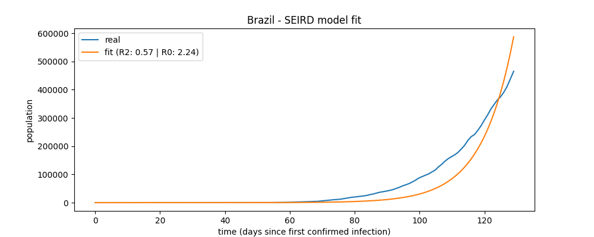

## About

**covid-seird** is a small Python package inspired by Henri Froese's post ['Infectious Disease Modelling: Beyond the Basic SIR Model'](https://towardsdatascience.com/infectious-disease-modelling-beyond-the-basic-sir-model-216369c584c4).

It implements the **SEIRD Epidemiological Model** on COVID-19 data.
- First, it **fits** a the SEIRD Model into the real timeline data of confirmed cases of COVID-19 of a country.
- Then, it **simulates** the SEIRD curves based on the previously fitted Model.
- As a result, the country **Basic reproduction number (R<sub>o</sub>)** of COVID-19 is computed.
- Also, the **fit and simulation plots** are available.


NOTE:
  The COVID-19 timelines data are obteined using the [COVID19Py package](https://github.com/Kamaropoulos/COVID19Py) in order to retrieve the Worldwide Data repository operated by the Johns Hopkins University Center for Systems Science and Engineering (JHU CSSE).

## Installation

In order install this package, simply run:

```bash
pip install covid-seird
```

## Usage

To use covid-seird, you first need to import the package and then create a new instance, passing the country code as a parameter:

```python
from covid_seird.country_covid_seird import CountryCovidSeird
brazil = CountryCovidSeird("br")
```

### Getting the country codes

```python
CountryCovidSeird.code_search("brazil")
```
output:
```python
{'BR': 'Brazil'}
```

### Fit the SEIRD Model

```python
brazil.fit()
```
After call the fit method, the fit score (R<sup>2</sup>) can be accessed:
```python
brazil.r2
```
output:
```python
0.5714748153246362
```
Also after fit method's call, the Basic reproduction number (R<sub>o</sub>) will be available:

```python
brazil.r0
```
output:
```python
2.2353912163446745
```
### Fit plot

```python
brazil.plot_fit("brazil_fit_plot")
```
a plot file named 'brazil_fit_plot' will be created.



### SEIRD simulation
